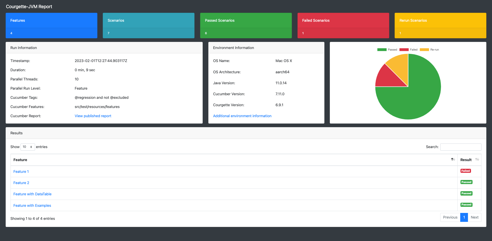
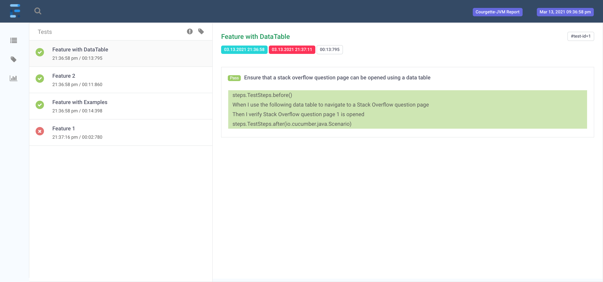

[](https://travis-ci.org/prashant-ramcharan/courgette-jvm)
[](https://search.maven.org/search?q=g:%22io.github.prashant-ramcharan%22%20AND%20a:%22courgette-jvm%22)
[](https://opensource.org/licenses/MIT)

# Courgette-JVM #

Courgette-JVM is an extension of Cucumber-JVM with added capabilities to **run cucumber tests in parallel on a feature level or on a scenario level**. It also provides an option to **automatically re-run failed scenarios**.

## Key Features
- **All features** can be executed in parallel.
- **All scenarios** can be executed in parallel.
- **Automatic re-run** of failed scenarios.
- **Requires only 1 annotated class** to run all feature files in parallel.
- **Single report generation** for all executed features including embedded files (Json and Html reports)
- **Publishes a single Cucumber Report** to https://reports.cucumber.io/ after parallel execution.
- **Single re-run file** listing all failed scenarios that occurred during parallel execution.
- Supports **Cucumber-JVM 7**
- Supports **JUnit** and **TestNG**
- Integrates with **Slack** to provide real time test results.
- Integrates with **Extent Reports** to create interactive reports.
- Integrates with **Report Portal** to support AI powered dashboards.
- Integrates with **Allure** to generate test reports.  
- Can be used with **Gradle** and **Maven**.
- Searchable and paginated **Courgette-JVM Html Report** which includes all step definitions, embedded screenshots, thrown exceptions, pie chart and Courgette run information.


## Minimum Requirements
- Java 8

## Installation

#### Maven
````xml
<dependency>
  <groupId>io.github.prashant-ramcharan</groupId>
  <artifactId>courgette-jvm</artifactId>
  <version>6.1.0</version>
</dependency>
````

#### Gradle
````gradle
compile 'io.github.prashant-ramcharan:courgette-jvm:6.1.0'
````

#### Included Cucumber Dependencies
* cucumber-core 7.1.0
* cucumber-java 7.1.0
* cucumber-java8 7.1.0
* cucumber-junit 7.1.0
* cucumber-testng 7.1.0


## Usage

Example projects:

* [Courgette-JVM with Gradle Example](https://github.com/prashant-ramcharan/courgette-jvm-example)
* [Courgette-JVM with Maven Example](https://github.com/prashant-ramcharan/courgette-jvm-maven-example)
* [Courgette-JVM with Selenium Example (_multiple browsers_)](https://github.com/prashant-ramcharan/courgette-jvm-selenium)
* [Courgette-JVM with Appium Example (_iOS_)](https://github.com/prashant-ramcharan/courgette-jvm-appium-ios)
* [Courgette-JVM with Appium Example (_Android_)](https://github.com/prashant-ramcharan/courgette-jvm-appium-android)
* [Courgette-JVM with Spring Example](https://github.com/prashant-ramcharan/courgette-jvm-spring-example)
* [Courgette-JVM with Allure Example](https://github.com/prashant-ramcharan/courgette-jvm-allure-example)
* [Courgette-JVM with Custom Class Path Example](https://github.com/prashant-ramcharan/courgette-jvm-classpath-example)

Courgette-JVM supports JUnit and TestNG to run cucumber features and scenarios in parallel. A JUnit runner class must be annotated with **@RunWith(Courgette.class)** and a TestNG runner class must extend **TestNGCourgette**.

* **threads** : The number of concurrent threads to run cucumber features where each thread is started in an independant JVM process.

    * _Example: If you have 10 cucumber features and you use 6 threads, 6 features would first run in parallel then the following 4 features would run in parallel_.

* **runLevel** : Options are CourgetteRunLevel.FEATURE or CourgetteRunLevel.SCENARIO

    * _If set to feature level, all features would run in parallel. If set to scenario level, all scenarios would be run in parallel._
    
* **rerunFailedScenarios** : If set to true, any failed scenario will be immediately re-run in the same thread. If the re-run succeeds, the initial failure will be ignored and not cause the build to fail.
    * _When using CourgetteRunLevel.SCENARIO, only failed scenarios will be re-run._
    * _When using CourgetteRunLevel.FEATURE, the entire feature (including all scenarios) will be re-run._

* **excludeFeaturesFromRerun** : If set, Courgette will prevent features from re-running when it fails.
    * _Example: If `excludeFeaturesFromRerun = {Feature1.feature}` and `Feature1.feature` and `Feature2.feature` both fail, Courgette will not re-run `Feature1.feature` but will re-run `Feature2.feature`. This is useful when you need to prevent a specific feature or scenario from re-running._

* **rerunAttempts** : The number of re-run attempts for a failed scenario. (_rerunFailedScenarios must be set to true_)

* **showTestOutput** : If set to true, the output for each feature will be redirected to the current I/O source or destination.

* **reportTargetDir** : Target directory where courgette-report is generated. Set to target by default.

* **plugin** : Courgette supported plugins
    
    * _reportportal: Allows the test results to be published to [Report Portal](https://reportportal.io/) at the end of the test run._
    * _extentreports: Creates an interactive report based on the [Extent Framework](http://extentreports.com/)_
  
* **environmentInfo** : Additional environment information that is displayed in the Courgette html report.
    * _Each grouping must be separated by a `;` character and adhere to the following format:  `key1=value1; key2=value2`._

* **disableHtmlReport**: If set, the Courgette and Cucumber html reports will not be generated at the end of the test run.
    * _Options are `HtmlReport.COURGETTE_HTML` and `HtmlReport.CUCUMBER_HTML`_
    
* **classPath**: Allows a custom class path to be used when running tests.
    * _The class path should point to:_ `{ "path-to-project-jars", "path-to-test-classes" }`
    
* **slackWebhookUrl**: The incoming webhook URL that Courgette uses to send messages to Slack.

* **slackChannel**: The Slack channels that Courgette will post messages to.

* **slackEventSubscription**: The Courgette events to subscribe to that gets posted to Slack. 
 
* **cucumberOptions** : The standard cucumber options for specifying feature paths, glue, tags etc..
    * The `publish` cucumber option (_supported from version 5.1.0_) will publish a single cucumber report after parallel execution. 
        * The published report link will be displayed in the console and saved to `${reportTargetDir}/cucumber-report-link.txt`.
        * The published report link is also linked in the Courgette html report.
        * To keep the published report forever, provide a `CUCUMBER_PUBLISH_TOKEN` via a system property or an environment variable. You can get your token from [https://reports.cucumber.io/profile](https://reports.cucumber.io/profile)

### Additional

* At the end of the test run, a **single report** ( _if included in the cucumberOptions_ ) listing all executed features and scenarios will be created in the specified report path.

* A **courgette-rerun.txt** file listing all failed scenarios will be created in the specified rerun plugin path or the target folder ( _default_ )

* A Courgette-JVM html report will be created in the reportTargetDir (_defaulted to the target directory_).

##### JUnit Runner

````java
@RunWith(Courgette.class)
@CourgetteOptions(
        threads = 10,
        runLevel = CourgetteRunLevel.SCENARIO,
        rerunFailedScenarios = true,
        rerunAttempts = 1,
        showTestOutput = true,
        reportTitle = "Courgette-JVM Example",
        reportTargetDir = "build",
        environmentInfo = "browser=chrome; git_branch=master",
        cucumberOptions = @CucumberOptions(
                features = "src/test/resources/features",
                glue = "steps",
                tags = "@regression and not @bug",
                publish = true,
                plugin = {
                        "pretty",
                        "json:build/cucumber-report/cucumber.json",
                        "html:build/cucumber-report/cucumber.html",
                        "junit:build/cucumber-report/cucumber.xml"}
        ))
public class RegressionTestSuite {
}
````


##### TestNG Runner

````java
@Test
@CourgetteOptions(
        threads = 10,
        runLevel = CourgetteRunLevel.SCENARIO,
        rerunFailedScenarios = true,
        rerunAttempts = 1,
        showTestOutput = true,
        reportTitle = "Courgette-JVM Example",
        reportTargetDir = "build",
        environmentInfo = "browser=chrome; git_branch=master",
        cucumberOptions = @CucumberOptions(
                features = "src/test/resources/features",
                glue = "steps",
                tags = "@regression and not @bug",
                publish = true,
                plugin = {
                        "pretty",
                        "json:build/cucumber-report/cucumber.json",
                        "html:build/cucumber-report/cucumber.html"}
        ))
public class RegressionTestSuite extends TestNGCourgette {
}
````


## Gradle Build Task

````gradle
tasks.withType(Test) {
    systemProperties = System.getProperties()
    systemProperties.remove("java.endorsed.dirs") // needs to be removed from Java 9
}

// JUnit
task regressionSuite(type: Test) {
    include '**/RegressionTestSuite.class'

    outputs.upToDateWhen { false }
}

// TestNG
task regressionSuite(type: Test) {
    useTestNG()

    include '**/RegressionTestSuite.class'

    outputs.upToDateWhen { false }
}
````

## Override Runner Options

To override the hard-coded courgette options (_threads, runLevel, rerunFailedScenarios, showTestOutput, reportTargetDir, environmentInfo_) set in the runner class, you can provide system properties to the gradle or maven task.

```java

[gradle | mvn] test -Dcourgette.threads=2 -Dcourgette.runLevel=FEATURE -Dcourgette.rerunFailedScenarios=false -Dcourgette.showTestOutput=true -Dcourgette.reportTargetDir=build -Dcourgette.environmentInfo="git_branch=master; platform=ci"

```

To override the hard-coded cucumber options (_tags, glue, plugin, name, junit_) set in the runner class, you can provide comma separated system properties to the gradle task.

```java

[gradle | mvn] test -Dcucumber.tags="@regression and not @bug" -Dcucumber.glue="steps, hooks"

```

To specify non standard VM options (_-X options_)

```java

[gradle | mvn] test -Dcourgette.vmoptions="-Xms256m -Xmx512m"

```

## JUnit Callbacks

You can add global setup and tear-down code to your Courgette test runner using the `@CourgetteBeforeAll` and `@CourgetteAfterAll` annotations. For example:

```java
@RunWith(Courgette.class)
@CourgetteOptions(/* Your Courgette options here... */)
public class RegressionTestSuite {
    @CourgetteBeforeAll
    public static void setUp() {
        System.out.println("I will run before any tests execute");
    }
    
    @CourgetteAfterAll
    public static void tearDown() {
        System.out.println("I will run after all of the tests execute");
    }
}
```

You can add any number of annotated methods to your test suite class. 
If you need your callbacks to run in a specific order, pass `order` to the annotation: `@CourgetteBeforeAll(order = 2)`.

## Slack Integration

Courgette allows real time test results and events to be posted to Slack as tests are run.

To enable this feature, add the following Courgette options to the Courgette runner:

````java
@CourgetteOptions(
      ...
      slackWebhookUrl = "https://hooks.slack.com/services/your-slack-url",
      slackChannel = {"channel1", "channel2"},
      slackEventSubscription = {CourgetteEvent.ALL},
      cucumberOptions = @CucumberOptions(
      // cucumber options here
      )
)
````

### Slack Incoming Webhook URL

You need to create an incoming webhook URL to allow Courgette to post messages to your Slack application. 

https://api.slack.com/messaging/webhooks#create_a_webhook


### Event Subscription

You can subscribe to single or multiple Courgette events. When events are triggered as the tests run, Courgette will post a message to the Slack channels defined in the runner.
  - ALL
  - TEST_RUN_STARTED
  - TEST_RUN_FINISHED
  - TEST_PASSED
  - TEST_PASSED_AFTER_RERUN
  - TEST_FAILED  
  - TEST_RERUN


## Report Portal Integration

Courgette allows test results to be published in real time to the [Report Portal](https://reportportal.io/) server as tests run. 

To enable this feature, add the following Courgette option to the Courgette runner:

````java
@CourgetteOptions(
      ...  
      plugin = { "reportportal" },
      cucumberOptions = @CucumberOptions(
      // cucumber options here
      )
)
````

You must have the **reportportal.properties** file in your classpath and the following properties must be defined:
````properties
# Report Portal server (mandatory)
rp.endpoint = http://localhost:8080

# Report Portal project (mandatory)
rp.project = courgette_example

# Report Portal API access token (mandatory)
rp.apitoken = a1e5ee78-317c-477d-b27e-f174c562aedc

# Report Portal launch name (optional)
rp.launch = My Demo Project

# Report Portal test suite (optional)
rp.testsuite = Regression Test Suite

# Report Portal launch attributes (optional)
# Each attribute must be separated by ';'
rp.attributes = suite:regression;build:12345
````

_Note: Any property other than those defined above will be ignored by Courgette._

An API access token is required to allow Courgette to publish the report. To obtain an API access token, log in to Report Portal UI and navigate to http://localhost:8080/ui/#api -> UAT -> sso-endpoint -> Get api token

After the test run is complete, the test results will be published to the Report Portal server.


## Extent Reports Integration

Courgette allows the creation of interactive reports using the Extent Reports Courgette plugin.

To enable this feature, add the following Courgette option to the Courgette runner:

````java
@CourgetteOptions(
      ...  
      plugin = { "extentreports" },
      cucumberOptions = @CucumberOptions(
      // cucumber options here
      )
)
````

At the end of the test run the report will be saved to `${reportTargetDir}/courgette-extentreports` 

To configure custom reports (_i.e. change the report name or theme_) you should create the `extent-config.xml` file in the classpath. Courgette will load this XML config when it builds the report. If this file is not provided then default values will be used. View an example [here](https://github.com/prashant-ramcharan/courgette-jvm-example/blob/master/src/test/resources/extent-config.xml)



## Allure Integration

Courgette allows the generation of Allure reports using the Allure Cucumber plugin.

````java
@CourgetteOptions(
      ...
      cucumberOptions = @CucumberOptions(
         plugin = {
            "io.qameta.allure.cucumber7jvm.AllureCucumber7Jvm"
         }
      )
)
````


## Limitations and Known Issues
   
  * Each feature / scenario is run using the Cucumber CLI and because of this JUnit is not notified off the result whilst the tests are being executed.

## Submitting Issues
For any issues or requests, please submit [here](https://github.com/prashant-ramcharan/courgette-jvm/issues/new)
